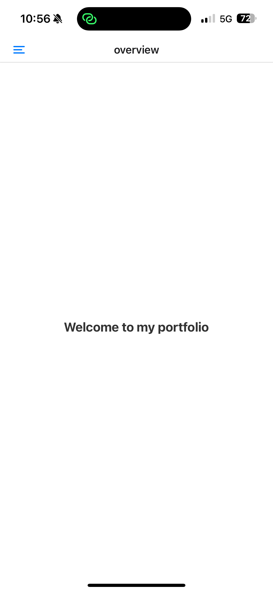

[<- Volver al README](../README.md)

# Configuración básica del proyecto Expo

|  |  |
| ----------------------------------------- | --------------------------------------------- |
| Pantalla de inicio                        | Despliegue de drawer                          |

Para la correcta configuración del proyecto, de manera que podamos trabajar con Expo Router para navegación entre pantallas a través de un Drawer (como vemos en la imagen superior), se han seguido los pasos indicados en al documentación oficial de Expo Go:

- Documentación básica expo-router: (https://docs.expo.dev/router/installation/#quick-start)
- Documentación para la implementación del Drawer: (https://docs.expo.dev/router/advanced/drawer/)

A continuación, explicaré paso a paso cómo he configurado la app:

## Dependencias Instaladas

En el archivo `package.json` de nuestro proyecto, podemos encontrar todas las dependencias necesarias para que nuestra aplicación funcione correctamente. Estas dependencias se dividen en tres categorías principales:

### Dependencias por Defecto

Cuando creamos un proyecto con `create-expo-app` usando el template `blank` con TypeScript, se instalan automáticamente las siguientes dependencias:

- **expo**: El framework principal para desarrollar aplicaciones con React Native.
- **react**: La biblioteca base para construir interfaces de usuario.
- **react-native**: El entorno que permite ejecutar React en dispositivos móviles.
- **typescript**: Herramienta para trabajar con TypeScript en el proyecto.
- **expo-status-bar**: Para personalizar y controlar la barra de estado (status bar) en dispositivos móviles.

### Dependencias Añadidas para `expo-router`

Para configurar la navegación basada en rutas con `expo-router`, hemos añadido las siguientes dependencias:

- **expo-router**: Biblioteca que permite implementar un sistema de navegación basado en archivos, similar al de Next.js.
- **expo-constants**: Proporciona constantes del sistema y de la aplicación, como el nombre de la aplicación, la versión, el ID del paquete, y más.
- **expo-linking**: Facilita el manejo de enlaces profundos (deep linking) en la aplicación. Permite que tu app responda a enlaces específicos, como abrir una pantalla particular cuando el usuario hace clic en un enlace externo.

> **¡IMPORTANTE!**  
> Durante la implementación, tuve problemas al no añadir explícitamente la versión correcta de `react-dom`. Automáticamente, el archivo `package-lock.json` seleccionó la última versión disponible (19.2.0), pero para que todo funcione correctamente, necesitamos usar la versión **19.1.0**. Asegúrate de instalarla con el siguiente comando:
>
> ```bash
> npm install react-dom@19.1.0
> ```

### Dependencias Añadidas para el Drawer

Para implementar un menú lateral (`drawer`), hemos añadido las siguientes dependencias:

- **@react-navigation/drawer**: Biblioteca para crear un menú lateral en la navegación.
- **react-native-reanimated**: Requerida para animaciones fluidas en la navegación.
- **react-native-screens**: Optimiza el rendimiento de las pantallas en la navegación.
- **react-native-safe-area-context**: Maneja áreas seguras en dispositivos con muescas o bordes redondeados.

## Modificaciones en ficheros de configuración

Estas configuraciones son esenciales para habilitar el sistema de enrutamiento basado en **Expo Router**:

#### Package.json

La línea `"main": "expo-router/entry"` se añadió para configurar el punto de entrada principal de la aplicación. Esto es necesario cuando usamos **Expo Router**, ya que este paquete requiere que el archivo de entrada sea gestionado por su sistema de enrutamiento. Al establecer esta configuración, nos aseguramos de que Expo Router pueda manejar correctamente las rutas de la aplicación.

> **¡IMPORTANTE!**  
> Hemos eliminado los archivos `App.tsx` e `index.ts`, ya que ahora el punto de entrada principal de la aplicación será gestionado dentro de la carpeta `app/`.

#### App.json

1. `"scheme": "pgl-navigation"`: Este esquema define un identificador único para los enlaces profundos (deep linking) en la aplicación. Es útil para manejar rutas específicas dentro de la app, permitiendo que se pueda abrir directamente en una pantalla particular desde un enlace externo.

2. `"plugins": ["expo-router"]`: Este campo asegura que el plugin de **Expo Router** se integre correctamente con la configuración de Expo. Esto permite que el sistema de enrutamiento funcione sin problemas y que se apliquen automáticamente las configuraciones necesarias para su uso.

## Codigo de navegación de prueba

Para verificar la correcta implementación de `expo-router`, he creado dos archivos clave dentro de la carpeta `/app`:

1. **`index.tsx`**: Este archivo actúa como la página de inicio de la aplicación.
2. **`_layout`**: Este archivo se utiliza para configurar la navegación tipo _drawer_.

Actualmente, estos archivos están en una fase inicial y no están completamente desarrollados. Sin embargo, proporcionan la estructura básica necesaria para la navegación.

Para obtener una explicación más detallada sobre la implementación final del _Drawer_, consulta el siguiente documento:

Para obtener una explicaión de la implementación de la pantalla de inicio, consulta el siguiente:

[<- Volver al README](../README.md)
