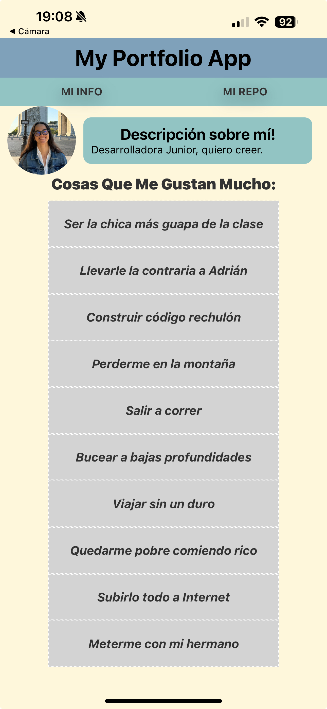
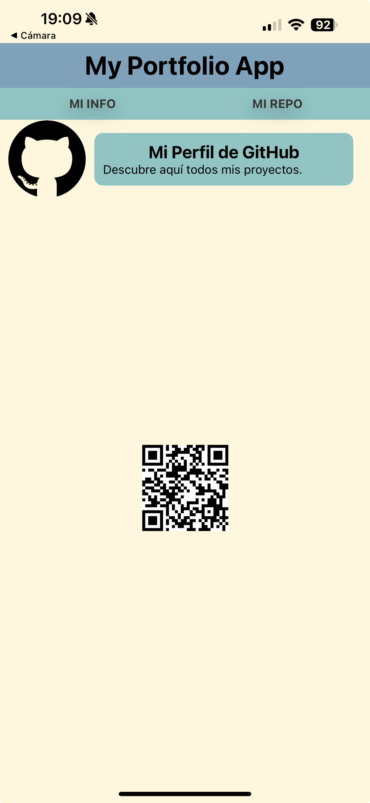
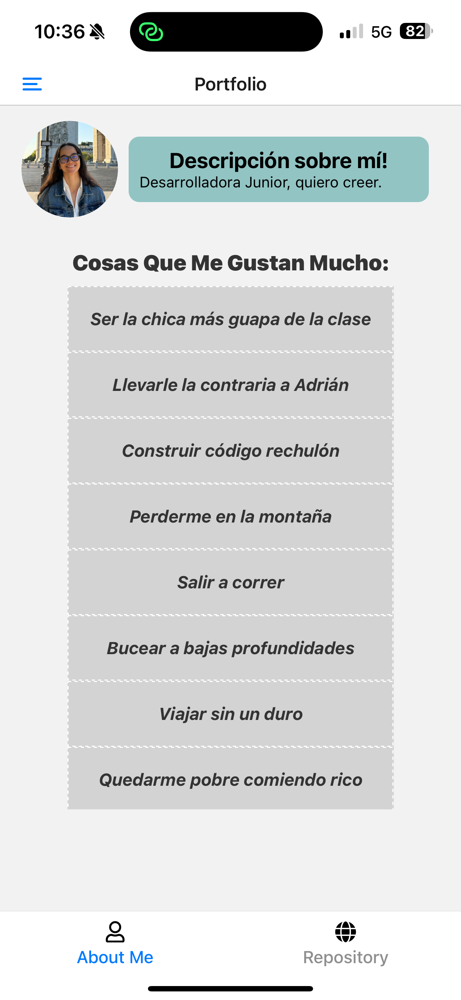
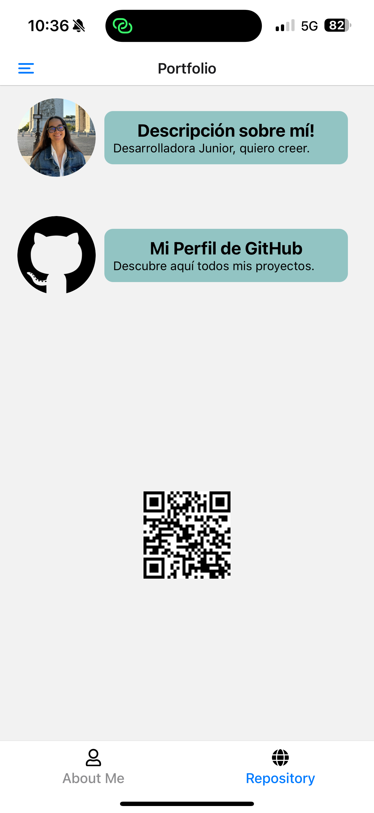

[<- Volver al README](../README.md)

# Reclicaje del Portfolio de la Unidad Anterior

En la unidad anterior de la asignatura se refactorizó un portfolio, cambiando tambien sus valores para fuera un portfolio propio.
Aquí muestro el proyecto anterior a reciclar:

|  |  |
| ----------------------------------------------- | ----------------------------------------- |
| Pantalla de Hobbies                             | Pantalla de Repo                          |

A continuación, explicaré como he reclijado dicho repositorio paso a paso para incluirlo en esta práctica con navegación

## Pantalla de Hobbies (About Me)

En el proyecto anterior, el código fue separado en diversos componentes para una correcta refactorización. Así, en mi anterior proyecto, contaba ya con diversas carpetas:

- `data`: que incluye la información mostrada en pantalla, como mis hobbies en este caso.

- `types`: para el tipado de clases como, por ejemplo, Card.

- `theme`: con los estilos globales de la aplicación.

- `components`: lo cual compondrán la pantalla visualizada, como Card (para la información breve mostrada en la parte superior) y List (para los hobbies).

Poco a poco, he añadido estos ficheros ya existentes en esta aplicación. La única diferencia es que ahora se manejará diferente la navegación entre esta pantalla y la siguiente.

## Pantalla de Repositorio (QR)

En primer lugar, he debido de instalar la dependencia `react-native-qrcode-svg` para poder generar el código QR hacia mi perfil de GitHub.

Entonces, utilizando la estructura de carpetas ya creada anteriormente, he añadido los datos en /data y agregado la misma página `Repo`creada en en el proyecto anterior a la carpeta /app.

> Como podemos ver, las tarjetas presentes en la parte superior de la aplicación utilizan el mismo tipado declarado en /types como CardItem.

## Componente como Cabecera (Card)

He diseñado en el proyecto anterior y traído a éste el componente `Card` para mostrar una cabecera de portfolio. Incluye una imagen (por ejemplo, una foto de perfil), título y una descripción.

### Props

El componente `Card` acepta las siguientes propiedades, definidas por el tipo `CardItem`:

- **`title`** (string): El título o nombre que se mostrará de forma destacada en la tarjeta.
- **`imageSource`** (`ImageSourcePropType`): La fuente de la imagen que se mostrará, típicamente una foto de perfil o avatar.
- **`bodyText`** (string): Una descripción o texto adicional para proporcionar más contexto sobre la persona o el portfolio.

### Uso

Este componente es ideal para crear una cabecera de portfolio que combine una imagen y una breve descripción. Puede ser estilizado adicionalmente para ajustarse al tema general de la aplicación.

### Ejemplo

```jsx
<Card
  title="Mi Portfolio"
  imageSource={require("./path/to/image.jpg")}
  bodyText="Desarrollador apasionado por la tecnología y el diseño."
/>
```

## Navegación con Tabs

En esta práctica, se ha implementado un sistema de navegación basado en pestañas para el portfolio. Este sistema permite alternar entre dos pantallas principales: "About Me" y "Repository".

### Estructura de Archivos

- **`/portfolio/_layout.tsx`**: Define la navegación por pestañas para la sección del portfolio utilizando el componente `Tabs` de `expo-router`. Contiene dos pestañas:

  1. **"About Me"**: Enlazada al archivo `about.tsx`.
  2. **"Repository"**: Enlazada al archivo `repo.tsx`.

  Cada pestaña incluye un icono y una etiqueta personalizada.

- **`about.tsx`**: Representa la pantalla "About Me", donde se muestra una lista de elementos utilizando el componente `List`.

- **`repo.tsx`**: Representa la pantalla "Repository", donde se muestra una tarjeta con información sobre el repositorio de GitHub y un código QR que enlaza al mismo.

- **`_layout.tsx` (directorio raíz)**: Define un sistema de navegación tipo drawer para la aplicación, con "Home" y "Portfolio" como secciones principales.

> El sistema asegura que el encabezado del portfolio (definido en el componente `Card`) sea visible en todo momento mientras se navega entre las pantallas "About Me" y "Repository".

## Captura del Resultado Final

|  |  |
| ---------------------------------------------- | ---------------------------------------- |
| Pantalla de Hobbies                            | Pantalla de Repo                         |

[<- Volver al README](../README.md)
