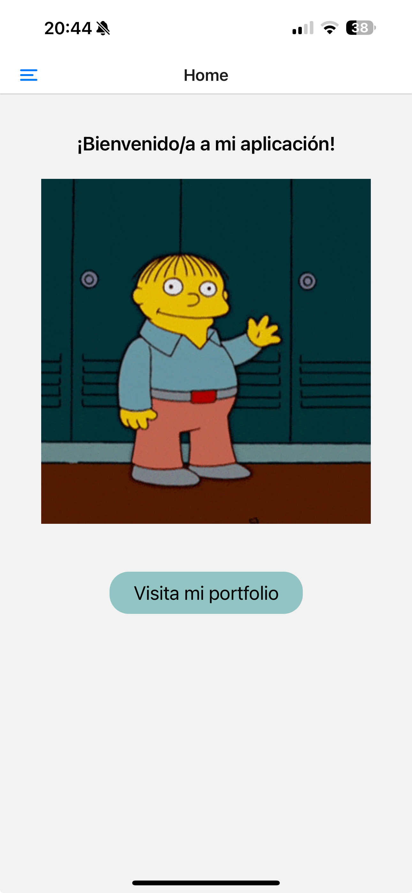

[<- Volver al README](../README.md)

# Pantalla de Bienvenida

La [pantalla de bienvenida](../app/index.tsx) es la primera vista que los usuarios encuentran al abrir la aplicación. Su propósito es ofrecer una introducción amigable y atractiva.

## Componentes principales

1. **Título de bienvenida**: Un mensaje centralizado que da la bienvenida al usuario.

   - Texto: "¡Bienvenido/a a mi aplicación!"
   - Estilo: Fuente de tamaño 20, negrita, y centrado.

2. **Imagen animada**: Una imagen GIF que refuerza el mensaje de bienvenida.

   - Ubicación: `../assets/images/welcome.gif`
   - Estilo: Anchura del 80% del contenedor.

3. **Botón de navegación**: Un botón interactivo que permite al usuario acceder al portfolio.
   - Texto: "Visita mi portfolio"
   - Acción: Navega a la ruta `/portfolio`.
   - Estilo: Fondo con el color secundario de la paleta, bordes redondeados, y texto de tamaño 20.

## Estilos

Los estilos de la pantalla están definidos en el archivo `index.tsx` utilizando `StyleSheet`. Además, se reutilizan estilos globales desde `../theme/styles`.

## Navegación

El botón utiliza el hook `useRouter` de `expo-router` para manejar la navegación dentro de la aplicación. Este hook nos permite acceder a un objeto `router` que contiene métodos útiles para gestionar las rutas.

### Implementación de la navegación

En el archivo `index.tsx`, se utiliza el siguiente código para configurar la navegación del botón:

1. **Importación del hook**: Se importa `useRouter` desde `expo-router`.
2. **Creación del objeto `router`**: Se inicializa con `const router = useRouter();`.
3. **Método `router.navigate`**: Se utiliza `router.navigate('/portfolio')` para navegar a la ruta `/portfolio` cuando el botón es presionado.

Este enfoque asegura una navegación fluida y permite mantener el código modular y reutilizable.

## Captura de Pantalla

[<- Volver al README](../README.md)
