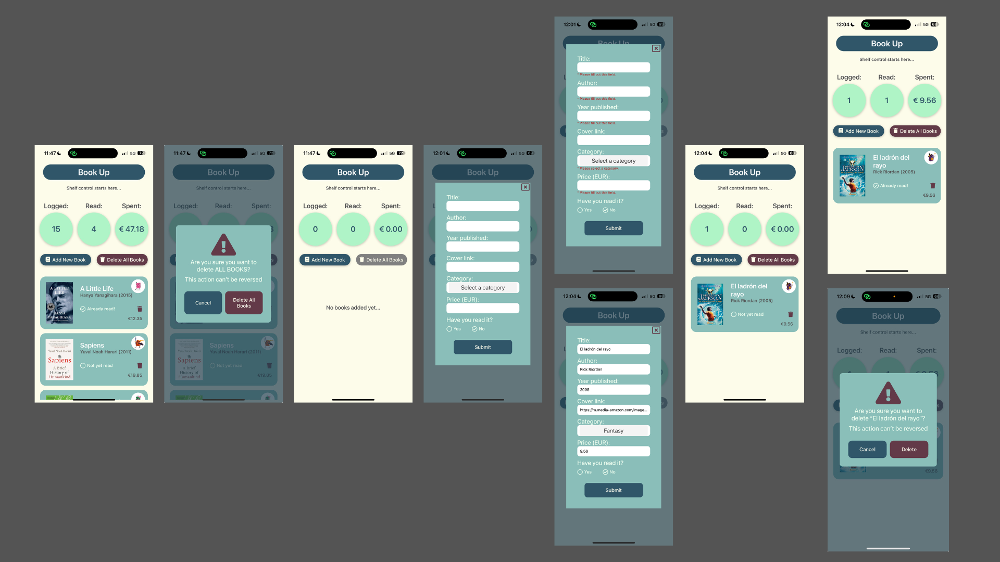

[<- Volver al README](../README.md)

# Implementación de Lista de Libros

La implementación de la lista de libros se ha realizado reutilizando un proyecto anterior. Todos los componentes, estilos, datos y páginas han sido adaptados e integrados en este proyecto.

[Accede al proyecto y toda su documentación haciendo clic aquí.](https://github.com/kiara-modo-estudiante/PGL-MyList-Books)

A continuación, se describen los elementos principales:

## **Estructura de Navegación (\_layout.tsx)**

El archivo `_layout.tsx` dentro del directorio `/books` define la estructura de navegación de la aplicación de Libros. Utiliza `Stack` de `expo-router` para gestionar las pantallas. Además, envuelve toda la navegación en un `BookProvider`, que proporciona un contexto global para manejar el estado de los libros.

- **Stack Navigation**: Se configuran dos pantallas:
  - `index`: La pantalla principal que muestra la lista de libros.
  - `modal`: Una pantalla modal con animación de desvanecimiento (`fade`) para agregar nuevos libros.
- **BookProvider**: Permite compartir el estado de los libros (como la lista de libros y las acciones asociadas) entre las diferentes pantallas.

#### **Pantalla Modal (modal.tsx)**

El archivo `modal.tsx` define una pantalla modal que permite al usuario agregar un nuevo libro.

- **Cierre del Modal**: Se utiliza el ícono `window-close` de `FontAwesome5` para cerrar el modal. Al hacer clic, se llama a `router.back()` para regresar a la pantalla anterior.
- **Formulario de Libros**: El componente `BookForm` se encarga de renderizar el formulario para agregar un nuevo libro.
- **Estilos**:
  - El fondo del modal tiene un color semitransparente (`rgba(33, 62, 77, 0.7)`) para resaltar el formulario.
  - El formulario está centrado y tiene un diseño limpio con bordes redondeados.

#### **Pantalla Principal (index.tsx)**

El archivo `index.tsx` define la pantalla principal donde se muestra la lista de libros y se gestionan las acciones principales.

- **Componentes Clave**:

  - `Header`: Muestra el encabezado de la aplicación.
  - `CounterRow`: Muestra un contador con información sobre los libros.
  - `BookList`: Renderiza la lista de libros.
  - `DeleteListConfirmation`: Un modal de confirmación para eliminar todos los libros.

- **Botones**:

  - **Agregar Libro**: Navega a la pantalla modal (`books/modal`) para agregar un nuevo libro.
  - **Eliminar Todos los Libros**: Abre un modal de confirmación. Si el usuario confirma, se elimina toda la lista de libros utilizando la función `deleteAllBooks` del contexto.

- **Estado Local**:

  - `isModalVisible`: Controla la visibilidad del modal de confirmación para eliminar todos los libros.

- **Deshabilitar Botón de Eliminación**: Si no hay libros en la lista, el botón de eliminar está deshabilitado y cambia su estilo para reflejar esta condición.

- **Estilos**:
  - Los botones tienen un diseño consistente con colores, sombras y bordes redondeados.
  - El diseño general utiliza un enfoque centrado con espaciado uniforme.

#### **Contexto Global (BookContext)**

El contexto global (`BookContext`) permite compartir el estado de los libros entre las pantallas. Esto incluye:

- La lista de libros.
- Funciones para agregar, eliminar o modificar libros.

## Flujo de Usuario

1. **Pantalla Principal**:

   - El usuario ve la lista de libros y puede agregar o eliminar libros.
   - Si no hay libros, el botón de eliminar está deshabilitado.

2. **Agregar Libro**:

   - Al presionar "Add New Book", se abre un modal con un formulario.
   - El usuario completa el formulario y el nuevo libro se agrega a la lista.

3. **Eliminar Todos los Libros**:
   - Al presionar "Delete All Books", se abre un modal de confirmación.
   - Si el usuario confirma, la lista de libros se vacía.

[<- Volver al README](../README.md)s
